<h1 align="center">Milestone Project 1 – Happy Tails Website</h1>

[View the live project here](https://jen-selby.github.io/MP1/)

Happy Tails website is a site that aims to meet both the business and user/customer needs for the fictional Happy Tails secure dog field business.

Secure dog fields are businesses which hire out use of a field to dog owners to enable them to exercise their dogs in a safe and private environment, they are growing in popularity in the UK with the rise in dog ownership.

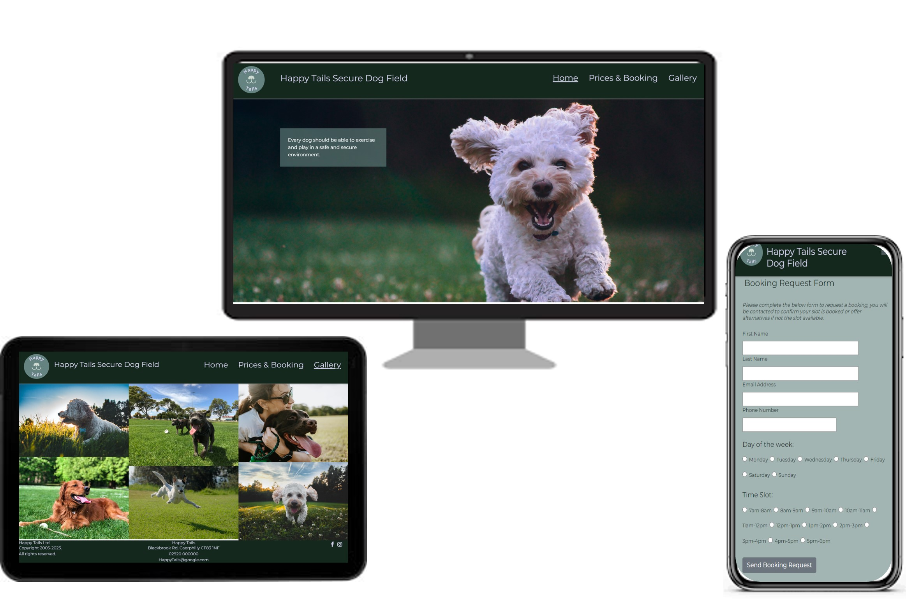

## Index – Table of Contents

- [Business & User Needs](#business-&-user-needs)
- [User Experience](#user-experience)
- [Features](#features)
- [Design](#design)
- [Wireframes](#wireframes)
- [Technologies Used](#technologies-used)
- [Testing](#testing)
- [Deployment](#deployment)
- [Credits](#credits)

## Business & User Needs

The site is targeted at dog owners looking for a secure private area to hire for exercising their dogs, these owners often have reactive, nervous or high energy dogs.
Many websites for similar business (fields, dog sitting, dog daycare, grooming, pet supplies sites ect) are outdated and poorly designed, often cluttered and lacking responsiveness. Having a professional, easy to use and clear website would set Happy Tails apart from the crowd.

### Business Needs:

- Increase awareness & promote the service
- Book more customers of the service
- Reduce “simple” questions being answered by staff on email/phone (such as opening times, prices, location ect) to reduce overhead and improve customer experience to gain such information

### User Needs:

- Easily understand the service offered
- See the facilities offered at the site
- Sight of prices & opening times
- Be able to locate the site & plan journey
- Ability to contact in a variety of methods (& social media)

## User Experience

### User Experience Stories

- 1. First Time Visitors Aims - As a first time visitor I want to:

  - Easily understand the main purpose of the business & site as well as learn more about the business
  - Easily navigate through the pages included within the site and have confidence I know where on the site I am at all times
  - Clearly see the facilities offered by the business at the field
  - Quickly and clearly see the cost of the services the business provides
  - Easily find the location of the field and view the travel route and time from my location

- 2. Returning Visitors Aims - As a returning visitor I want to:

  - Be able to easily see how to book use of the field
  - Contact the business using their contact details with questions & feedback

- 3. Frequent Visitors Aims - As a frequent visitor I want to:
  - Quickly access the booking request form using the navigation

### Features considered for inclusion:

- Summary of service (easily understandable)
- List of facilities
- Price list
- Map
- Contact details
- Contact form
- Social media
- Pictures gallery

## Features

## Existing Features

### All Pages

Header

- Shows the company logo and name enabling users to be clear which businesses website they are one

Navigation bar

- Allows users to navigate between the three pages of the site, Home, Prices & Booking and Gallery
- Highlights the current page the user is on for clarity for users
- Hover over the navigation to a different page highlights, giving a responsive feel to the site for users

Footer

- Details the contact details for the business, this is useful for users who wish to have more information
- Links to social media accounts of the business, Facebook and Instagram. The business would be best placed using those social media platforms due to the visual nature. The user can click on these to be taken to the sites and see content the business has created, it encourages them to connect with the business and gives the business the opportunity to communicate with customers frequently

### Home Page

Mission Area

- Includes a photograph of a happy dog, giving a positive emotion in the user. Users are intended to be dog owners who typically enjoy seeing images of pets
- An overlay box includes a mission statement from the business, quickly showing users what the business is about and prioritises

Facilities Area

- Allows the user to quickly see the key features and benefits of using the business
- Bulleted content intended to be easy to consume and to avoid a cluttered page and superfluous text.
- As in the Mission area, a image of a dog which will be attractive to the intended user group

Map

- Embedded google map to visually show users where the business is located
- Does this enable them to click and plan their journey?

### Prices & Booking Page

Prices section

- Gives a clear, bulleted prices list for clarity on the cost of the services for users

Booking

- Includes a booking request form enabling users to select a day and time to request booking the field
- Inputs have been styled specific to the type of input for user ease

### Gallery page

- Includes a number of high-quality images of happy dogs exercising, intended to give the user insight into how the businesses field is utilised and a positive feeling.

### How the features support the user stories

The user stories (1-3) with bullets categorised as letters (a, b, c, ...) are listed below mapped to the features that support them:

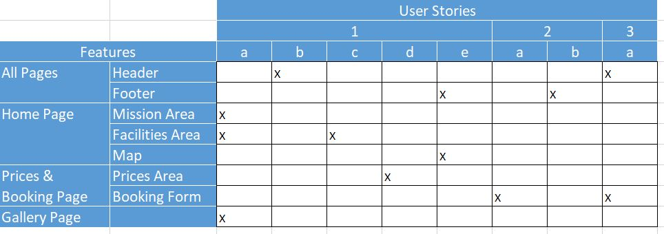

## Features which could be implemented in the future

- Contact form - allowing users to contact the business directly from the website rarther than the contact details

## Design

### Colour Scheme

Green tones were chosen as the basis for the colour pallette to mirror the outdoorsy nature of the business.
The pallette was then generated using [coolers](https://coolors.co/) colour generator

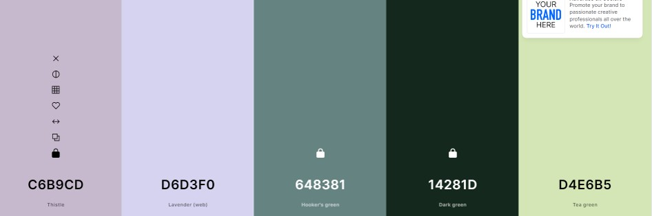

## Wireframes

### Home page

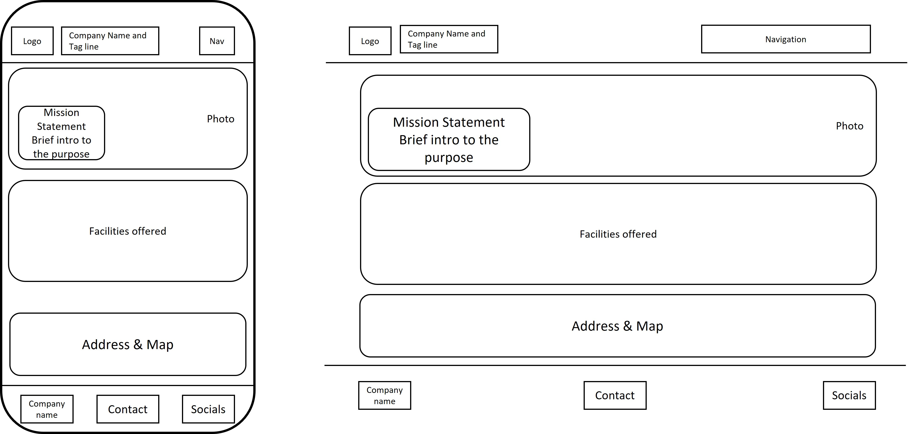

### Prices & Booking page

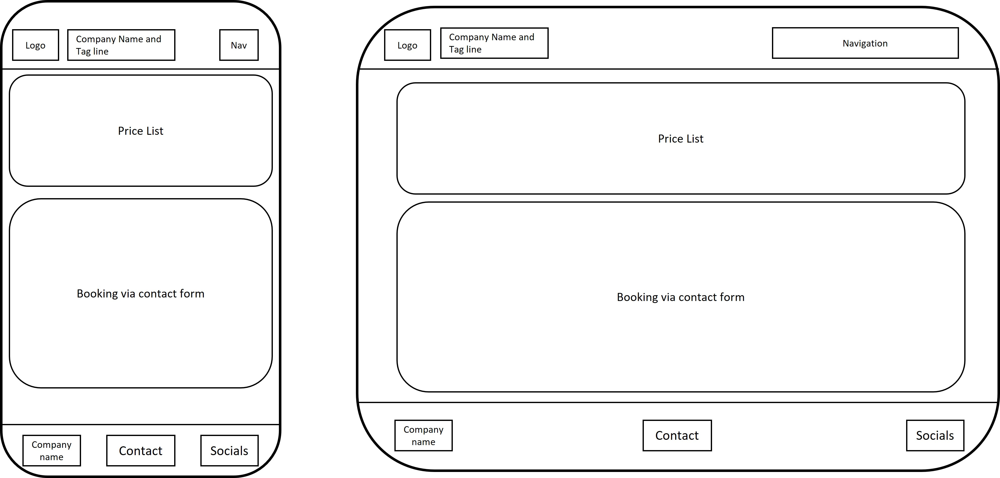

### Gallery page

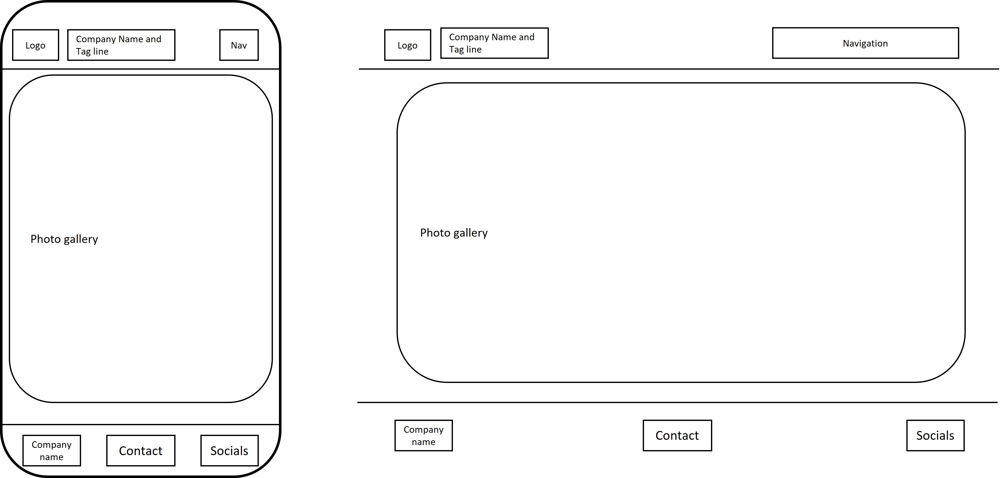

## Technologies Used

### Languages Used

- HTML5
- CSS3

### Frameworks, Libraries & Programs Used

- Google Fonts: was used to import the 'Montserrat' fonts into the style.css file which are used on all pages of the project.
- Font Awesome: was used to add icons for aesthetic and UX purposes.
- Bootsrap was used for styling elemnts throughout
- Git: was used for version control by utilising the codeanywhere terminal to commit to Git and Push to GitHub.
- GitHub: is used as the respository for the projects code after being pushed from Git.

- Microsoft Powerpoint: was used to create the wireframes during the design process.

## Testing

### Validator Testing

HTML: W3S Validator

- Index.html - no errors & 1 warning
  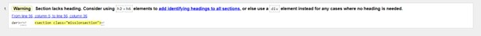

- Gallery.html - no errors & 1 warning
  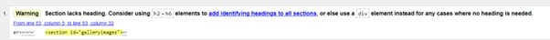

- Pricesbooking.html - no errors or warnings
  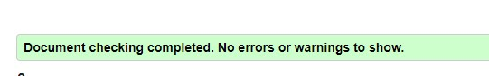

CSS: Jigsaw Validator

- Style.css - no errors
  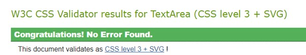

### Browser Compatibility

Testing has been carried out on the following browsers :

- Chrome Version 114.0.5735.199 (Official Build) (64-bit)
- Edge Version 114.0.1823.79 (Official build) (64-bit)

### Test Cases and Results

The below table details the test cases that were used and the results:

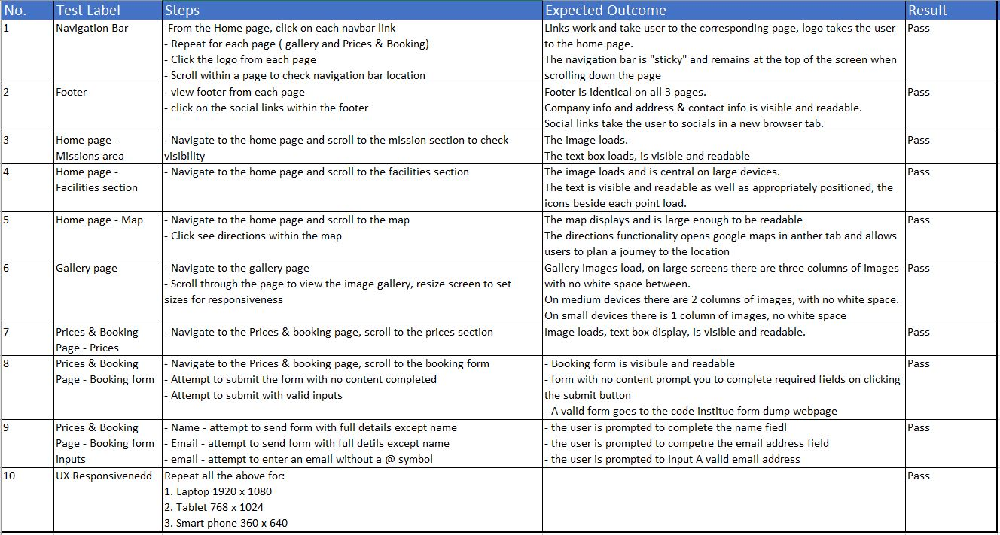

### Bug Fixes

- Navigation bar- adding the collapsible navigation bar introduced errors in the logo and heading text within the header. This was fixed by using the Bootstrap grid system and using this also helped in making this responsive to different size devices.
- Footer – the footer when first introduced was “sticky” and remained on the screen regardless of where on the page the user was located. This did not give a good user experience and therefore was fixed by removing the stickiness.
- Gallery – The gallery images had white space between each column despite previously believing this had been removed. This was resolved using removing the line spacing
- Home Page facilities text – the right/bottom section of text within the facilities section of the homepage was set to the right when a smaller device was used instead of being cantered as the left/top text section. This was fixed using styling in the css file.

### Unfixed Bugs

- Home Page - There is too much white space between the facilites and map section on the home page, this should e reduced
  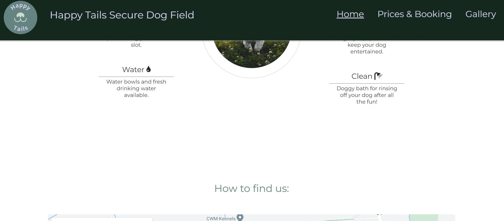

- Prices & Booking Page - The prices text box floats over the head when scrolling down the page, this should instead stay static.
  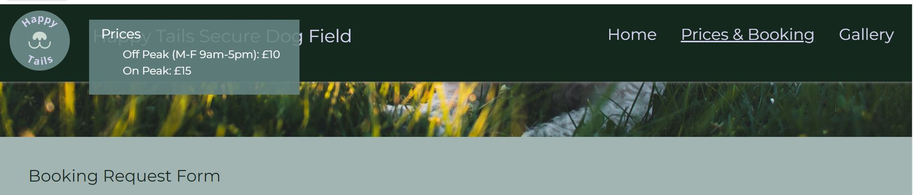

## Deployment

### How this site was deployed

- In the GitHub repository, navigate to the Settings tab, then choose Pages from the left hand menu
- From the source section drop-down menu, select the Master Branch
- Once the master branch has been selected, the page will be automatically refreshed with a detailed ribbon display to indicate the successful deployment
- Any changes pushed to the master branch will take effect on the live project
- The live link can be found here - 

### How to clone the repository

- Go to the https://github.com/Jen-Selby/MP1 repository on GitHub
- Click the "Code" button to the right of the screen, click HTTPs and copy the link there
- Open a GitBash terminal and navigate to the directory where you want to locate the clone
- On the command line, type "git clone" then paste in the copied url and press the Enter key to begin the clone process

## Credits

### Content

- W3 School and Bootstraps online documentation have been used throughout for guidance

- Navigation bar - Collapsible navigation bar code was taken from [LogRocket](https://blog.logrocket.com/create-responsive-mobile-menu-with-css-no-javascript) and adapted to fit the site

- Home page
  - Mission section - Taken from Code Institutes Love Running project and adapted to fit the site
  - Facilities section - Taken from Code Institutes Love Running project and adapted to fit the site
  - Map – Created using a [YouTube tutorial](https://www.youtube.com/watch?v=4U_AAGHzTok) and adapted to fit the site
- Prices & Booking Page, Prices section - Taken from Code Institutes Love Running project and adapted to fit the site

### Media

- Logo creator – Logo created using a free logo creator website [logo-maker](https://logo-maker.freelogodesign.org/en)
- Images - Images throughout the website have been taken from [unsplash](https://unsplash.com/s/photos), namely the contributors "Joe Caione", "Ron Fung", "Ben Pitasky", "Mathew Smith" & "Wade Austin Ellis"
